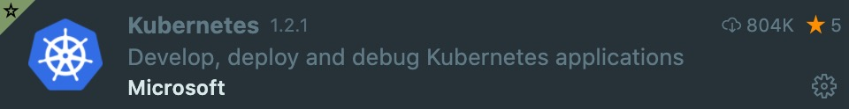
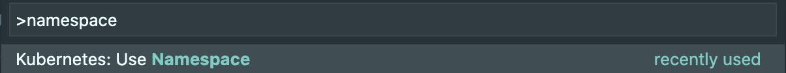
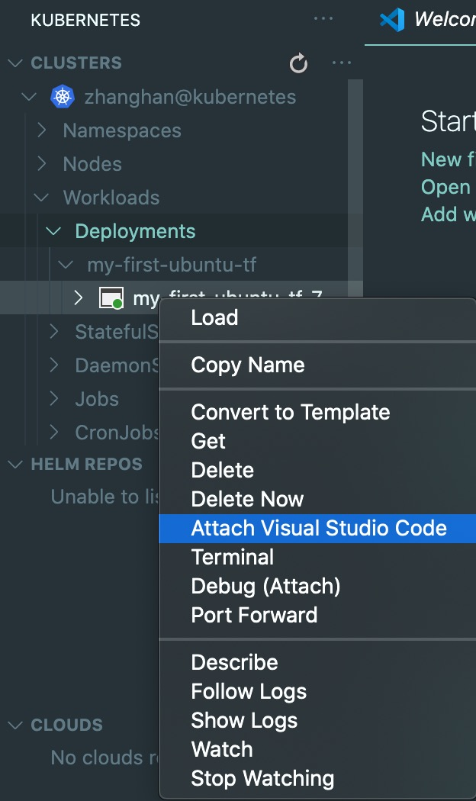

# 使用 VS Code 连接 POD 进行远程调试

使用 [VS Code](https://code.visualstudio.com/) 可以远程 debug 集群中创建的 POD。这里我们给出一个简单的教程，更多的信息请自行查阅 [Kubernetes 文档](https://kubernetes.io/zh/docs/concepts/services-networking/service/)与 [VS Code 文档](https://code.visualstudio.com/docs/azure/kubernetes)。

首先我们需要在 VS Code 中安装`Kubernetes`插件：

使用`ctrl + shift + P`（Mac 下`command + shift + P`）选择`Kubernetes: Use Namespace`

输入自己的 namespace 后就能访问自己namespace下的资源了。以连接一个 POD 作为示例：

这样将会自动连接一个 VS Code 远程窗口，之后的开发就和本地类似了。
