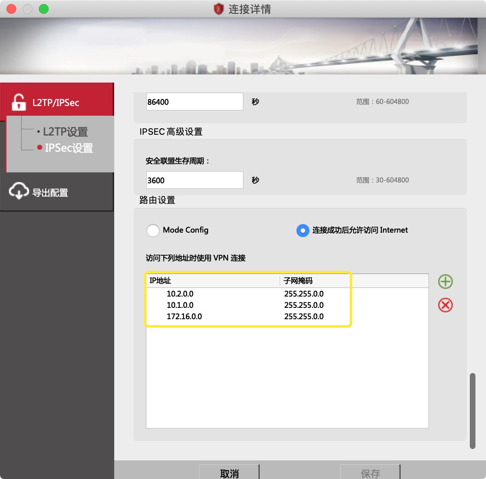

# 环境配置

我们这里介绍连入集群所需的[网络 VPN 配置](#配置VPN连接)、[ kubectl 连接工具](#kubectl安装)以及[ kubeconfig 连接配置](#kubeconfig获取)获取。

## 配置VPN连接

和集群建立网络连接需要配置VPN以建立和集群的网络连接，其中VPN的账户密码的获取请联系尹伟老师。建立了VPN连接后，在 secoclient 中加入指定路由以使得对集群的访问通过VPN：

|IP地址|子网掩码|备注|
|-----|-------|----|
|172.16.0.0|255.255.0.0|**西安GPU集群**|
|10.1.0.0|255.255.0.0|蒙明伟集群物理机|
|10.2.0.0|255.255.0.0|蒙明伟集群虚拟机|



## kubectl安装

`kubectl` 为检查集群资源，创建、删除和更新组件，查看新集群，并启动实例应用程序的命令行工具。最详细的安装方式请参考[官方文档](https://kubernetes.io/zh/docs/tasks/tools/install-kubectl/)。

#### 从Github下载kubectl

若因为一些原因不能安装成功 `kubectl`，则可以从Github上直接下载。进入 Kubernetes 的[Github release 页面](https://github.com/kubernetes/kubernetes/releases)，在最新的release下找到CHANGELOG链接。以`v1.19.0`为例:

> Additional binary downloads are linked in the [CHANGELOG/CHANGELOG-1.19.md](https://github.com/kubernetes/kubernetes/blob/master/CHANGELOG/CHANGELOG-1.19.md#downloads-for-v1190).

在`Client Binaries`一节找到自己系统对应的二进制文件：
|系统|二进制文件名|
|---|----------|
|MacOS|kubernetes-client-darwin-amd64.tar.gz|
|Linux（64位）|kubernetes-client-linux-amd64.tar.gz|
|Linux（32位）|kubernetes-client-linux-386.tar.gz|
|Windows（64位）|kubernetes-client-windows-amd64.tar.gz|
|Windows（32位）|kubernetes-client-windows-386.tar.gz|

解压并放入 `PATH` 中（Windows下将`kubectl.exe`加入环境变量）：

```bash
# MacOS or Linux
tar xzf kubernetes-client-*
chmod +x kubernetes/client/bin/kubectl
mv kubernetes/client/bin/kubectl /usr/local/bin/kubectl
```

确认安装成功

```bash
kubectl version
```

## kubeconfig获取

`kubectl`需要一个[kubeconfig 配置文件](https://kubernetes.io/docs/tasks/access-application-cluster/configure-access-multiple-clusters/)使其找到并访问`Kubernetes`集群。通过VPN与集群网络建立连接后，用户可以[自主访问配置生成页下载](http://harbor.iiis.co:31388/)用以访问集群的`kubeconfig`配置文件（用户名密码同VPN用户名密码，请咨询尹伟老师），同时集群会分配一个namespace给每个用户，**用户只有在各自的命名空间内有增删改查的权限**。

最后将`config`文件放在`~/.kube`下，并通过获取集群状态检查`kubectl`是否被正确配置：

```bash
$ kubectl cluster-info
Kubernetes master is running at https://172.16.112.220:6443

To further debug and diagnose cluster problems, use 'kubectl cluster-info dump'.
```