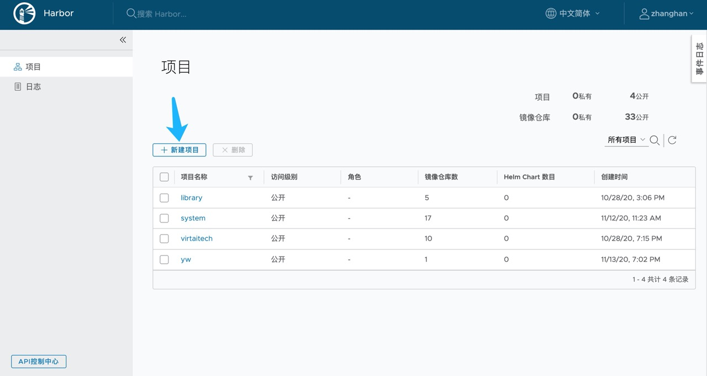
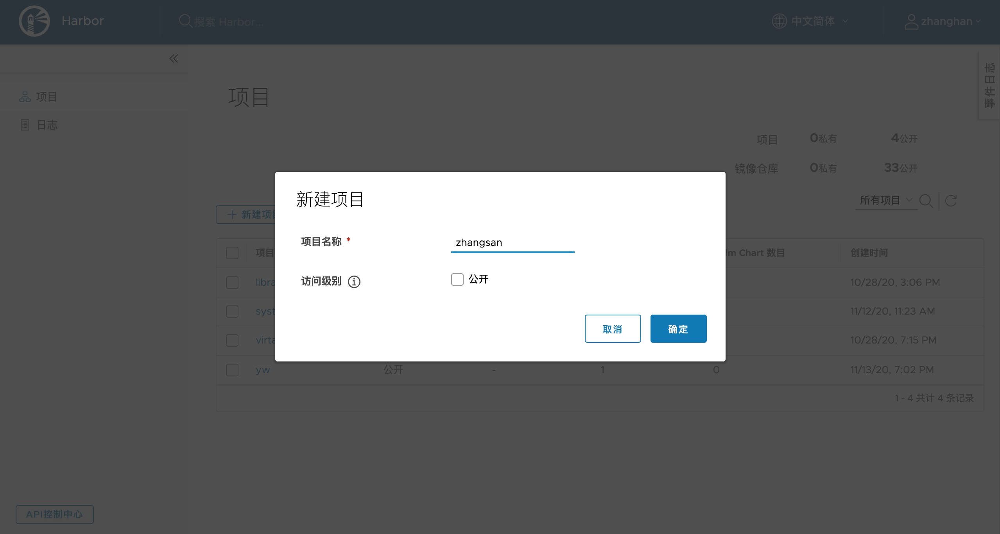

# 自定义镜像

我们可以在集群里从自定义镜像拉起 POD，以支持快速的实验环境配置。自定义镜像的思路是**在`ubuntu-tensorflow`、`ubuntu-pytorch`或`orion-client-2.4.2`的基础上，配置自己的环境**。

## 信任集群 Harbor

自定义镜像需要从 Harbor 拉取，因此我们需要在 Docker 中添加对集群 Harbor 的信任。在Mac下用 Docker Desktop 可以直接在客户端里加入`insecure-registries`项：


若未使用 Docker Desktop，则在`/etc/docker/deamon.json`中添加（若该文件不存在则创建）：

```json
{
  ...
  "insecure-registries": [
    "harbor.iiis.co:30006"
  ]
}
```

## 制作镜像

制作镜像的方式有基于 Dockerfile 和 `docker commit`命令两种形式。我们这里推荐基于 Dockerfile 方式，`docker commit`方式请参考[官方文档](https://docs.docker.com/engine/reference/commandline/commit/)。

> **_NOTE:_** 在[这里](https://github.com/iiisthu/gpupool/tree/master/examples/build_example)可以找到我们在这一节所使用的例子。

我们假设在`ubuntu-pytorch`的基础上，我们还需要配置一系列环境：

1. 安装一系列 Python 依赖库，在`requirements.txt`中指明。
2. 将某个 Python 包的 Git 仓库放入镜像，并从仓库源码安装该 Python 包。
3. 创建`workspace`工作目录。

其他的操作可以参考这几个任务。我们假设我们在`build`目录下工作，我们使用[`navdeep-G/samplemod`](https://github.com/navdeep-G/samplemod)作为 Python Package 的例子。

### 环境准备

假设我们需要 Python 支持一系列的库，例如画图的`matplotlib`和交互式的`jupyter`等，我们将这些写在`build`目录下：

```txt
# requirements.txt
numpy >= 1.19
matplotlib
pandas >= 1.0
jupyter
```

我们也希望pod能安装我们自己的一个私有代码仓库中的某个 Python Package，我们以[`navdeep-G/samplemod`](https://github.com/navdeep-G/samplemod)为例：

```bash
# PWD: build/
git clone https://github.com/navdeep-G/samplemod
```

整个工作目录为：

```
build
├── samplemod
│   ├── docs/
│   ├── sample/
│   ├── tests/
│   ├── .gitignore
│   ├── LICENSE
│   ├── MANIFEST.in
│   ├── Makefile
│   ├── README.rst
│   ├── requirements.txt
│   └── setup.py
└── requirements.txt
```

### 编写 Dockerfile 制作镜像

我们从`harbor.iiis.co:30006/library/`下的镜像出发，安装`requirements.txt`中的依赖，并安装数据。我们这里不赘述[ Dockerfile 的语法](https://docs.docker.com/engine/reference/builder/)。实例的 Dockerfile 如下：

```docker
# Dockerfile
FROM harbor.iiis.co:30006/library/ubuntu-pytorch:1.5.0
COPY . build
RUN pip install -r build/requirements.txt
RUN cd build/samplemod; pip install .
RUN mkdir -p workspace
RUN rm -rf build
```

之后利用`docker`按照 Dockerfile 制作镜像，并标记为`sample:v0`：

```bash
docker build . -t sample:v0
```

最后确认镜像已经成功创建：

```
$ docker images | grep sample
sample          v0         707ab1c88146        30 seconds ago       11.3GB
```

## 从自定义镜像创建 Pod

从刚才我们制作的镜像创建 Pod 分为两步，首先需要将镜像推送到集群镜像仓库 Harbor，再从 Harbor 对应的镜像拉起 Pod。

在连接 VPN 后，访问[harbor.iiis.co](http://harbor.iiis.co)，用户名密码同 VPN。

> **_NOTE:_** 注意这里的用户名不需要加入域名信息，即只需要`username`而不是`username@iiis.co`。

连接到 Harbor 后新建项目：





假设我们的项目名为 zhangsan，则我们之后的镜像均要 push 到`harbor.iiis.co:30006/zhangsan/`下，首先 tag 我们做好的镜像：

```bash
docker tag sample:v0 harbor.iiis.co:30006/zhangsan/sample:v0
```

之后将镜像 push 到 Harbor 中，我们需要先在 docker 中登录我们在 Harbor上的账号：

```txt
$ docker logout harbor.iiis.co:30006
Removing login credentials for harbor.iiis.co:30006
$ docker login harbor.iiis.co:30006
Username: zhangsan
Password:
Login Succeeded
```

最后将镜像推送到 Harbor 中：

```bash
docker push harbor.iiis.co:30006/zhangsan/sample:v0
```

创建好镜像后，拉起 Pod 流程和标准镜像一样。
