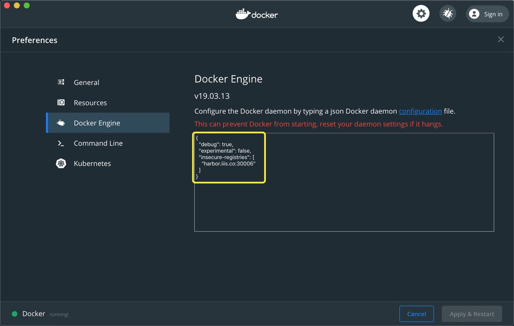

# 自定义镜像

我们可以在集群里从自定义镜像拉起 POD，以支持快速的实验环境配置。

## 信任集群 Harbor

我们需要在 Docker 中添加对集群 Harbor 的信任。在Mac下用 Docker Desktop 可以直接在客户端里加入`insecure-registries`项：



若未使用 Docker Desktop，则在`/etc/docker/deamon.json`中添加：

```json
{
  "insecure-registries": [
    "harbor.iiis.co:30006"
  ]
}
```